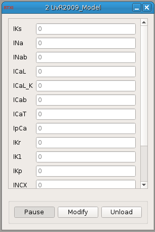

###Livshitz-Rudy Model (2009)

**Requirements:** None  
**Limitations:** None  

<!--start-->

2009 Luvshitz-Rudy model of a ventricular guinea pig myocyte. The model parameters are taken from a Matlab model generated by Eric Sobie. 

<!--end-->

####Input Channels
1. input(0) - Istim : applied current (A)

####Output Channels
1. output(0) - Vm : membrane voltage (mV)

####Parameters
1. Rate - model integration rate (Hz)

####States
1. IKs (A/F)
2. INa (A/F)
3. INab (A/F)
4. ICaL (A/F)
5. ICal_K (A/F)
6. ICab (A/F)
7. ICaT (A/F)
8. IpCa (A/F)
9. IKr (A/F)
10. IK1 (A/F)
11. IKp (A/F)
12. INCX (A/F)
13. INaK (A/F)
14. Itotal (A/F)
